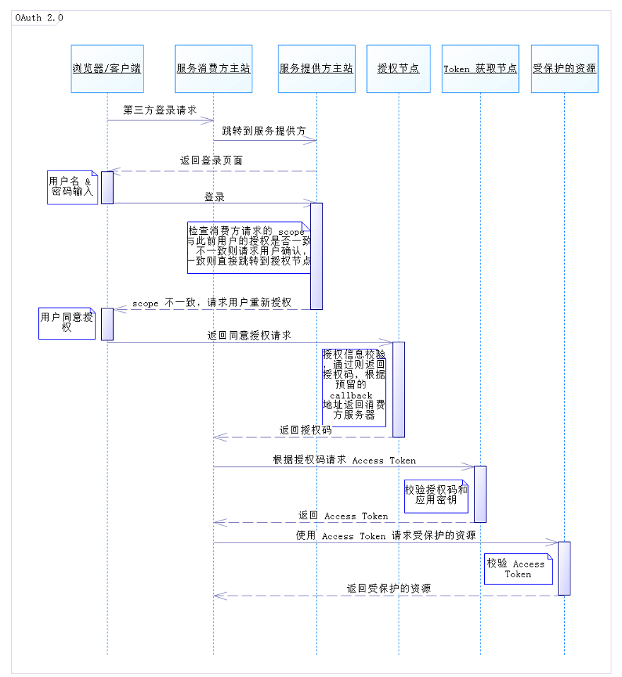
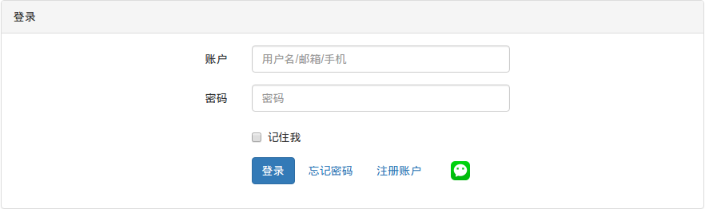
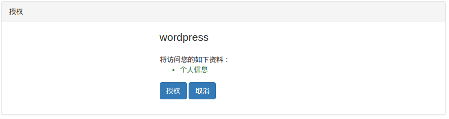

# API

| 接口 | 方法 | 分组 | 说明 |
| ----- | ----- | ---- | ----- |
| [/api/oauth/accessToken](#api-1-12) | POST | OAuth | 获取access_token |
| [/api/user](#api-2-21) | GET | 用户 | 获取用户信息 |
| [/api/user](#api-2-22) | POST | 用户 | 用户注册 |
| [/api/user](#api-2-23) | PUT | 用户 | 修改用户信息 |
| [/api/user/role](#api-2-24) | GET | 用户 | 获取用户角色 |
| [/api/user/permission](#api-2-25) | GET | 用户 | 获取用户权限 |
| [/api/user/rolePermission](#api-2-26) | GET | 用户 | 获取用户角色和权限 |
| [/api/sms/code](#api-5-51) | POST | 短信 | 发送验证码 |
| [/api/sms/code](#api-5-52) | PUT | 短信 | 验证验证码 |
| [/api/email](#api-6-61) | POST | 邮件 | 发送邮件 |
| [/api/file](#api-7-71) | POST | 文件 | 上传文件 |
| [/api/log](#api-8-81) | POST | 日志 | 记录日志 |

## 1. 登陆

登陆采用 OAuth2 协议，该协议为用户资源的授权提供了一个安全的、开放而又简易的标准。OAuth2 允许第三方开发者在用户授权的前提下访问在用户在 UCenter 存储的各种信息。

*注：关于OAuth2 的详细介绍参考: [理解OAuth 2.0](http://www.ruanyifeng.com/blog/2014/05/oauth_2_0.html)*




### 1.1 UCenter统一身份认证

+ 将用户引导到 UCenter 第三方登录页面上。如下链接：

```
https://ucenter.szjlxh.com/oauth/authorize?client_id={client_id}
&redirect_uri={redirect_uri}&response_type=code[&scope={scope}]
```
+ 如用户未登录 UCenter，跳转到登录页面



+ 用户登录，并对应用请求的 `scope` 进行授权。




+ 授权通过，Ucenter 会将**授权码**回传给应用在 Ucenter 注册的回调地址`（http://xxx.com/callback?code=xxx）`，应用直接获取授权码 `code` 即可。

+ 应用向 UCenter 的 Token Endpoint 发送请求：

```
https://ucenter.szjlxh.com/api/oauth/accessToken?client_id={client_id}&client_secret=
{client_secret}&grant_type=authorization_code&redirect_uri={redirect_uri}&code={code}
```

**Response:（点击代码展开）**
```js
{
    "code": 1,
    "message": "获取access_token成功",
    "data": {
        "access_token": "AynyRZKKskMBs4ONjOHUecgAyM2rqpvToo0QTXPA",
        "token_type": "Bearer",
        "expires_in": 3600,
        "refresh_token": "mcQNthVcEJpn09MObyxXerv4tiQq9I2z85NAe2ye"
    }
}
```

+ Response body 中的 `code` 为 1，表示正常接收请求。如果 `code` 非 1，表示请求异常，请参照 `message` 中的返回信息进行处理。

+ 使用 `access_token` 访问受保护的资源
`https://ucenter.szjlxh.com/api/user?access_token={access_token}`

### 1.2 授权模式

* 客户端必须得到用户的授权(authorization_grant)，才能获得令牌(access_token)。UCenter 提供三种授权方式:

##### 1.2.1 授权码模式(authorization_code)
* 1.1 **UCenter统一身份认证**中用到的就是授权码模式，开发者填写对应的`client_id`, `client_secret`, `redirect_uri`即可调用统一身份认证。

##### 1.2.3 密码模式(password)
* 密码模式用于非PC或WAP端的身份认证，如：APP登陆。

`POST /api/oauth/accessToken`

| 参数 | 类型 | 必填 | 说明 |
| ----- | ----- | ---- | ----- |
| client_id | string | Y | client_id |
| client_secret | string | Y | client_secret |
| grant_type | string | Y | 值 = password |
| username | string | Y | 用户名/手机号/邮箱 |
| password | string | Y | 密码 |

**Response:（点击代码展开）**
```js
{
    "code": 1,
    "message": "获取access_token成功",
    "data": {
        "access_token": "JQrKik8HTWaW2G2Aq2QKh9hYGK0Ntfv4Tc42rpJA",
        "token_type": "Bearer",
        "expires_in": 3600,
        "refresh_token": "JsFrLIQfKZ4YVba5qUS2q1UyXE24pJCkO5NC9i3I"
    }
}
```

##### 1.2.4 客户端模式(client_credentials)
* 客户端模式用于未登陆时的接口授权，此时只能访问不需要登陆的接口，如：注册时的发送验证码。

`POST /api/oauth/accessToken`

| 参数 | 类型 | 必填 | 说明 |
| ----- | ----- | ---- | ----- |
| client_id | string | Y | client_id |
| client_secret | string | Y | client_secret |
| grant_type | string | Y | 值 = client_credentials |

**Response:（点击代码展开）**
```js
{
    "code": 1,
    "message": "获取access_token成功",
    "data": {
        "access_token": "zmRIEouBx0YzoDgRrOxb1alTx3GiCOAFOAyUrJd5",
        "token_type": "Bearer",
        "expires_in": 3600
    }
}
```

## 2. 用户

### 2.1 获取用户信息
`GET   /api/user`

| 参数 | 类型 | 必填 | 说明 |
| ----- | ----- | ---- | ----- |
| acess_token | string | Y | access_token |
| user_id | int | N | 用户ID |

**Response:（点击代码展开）**
```js
{
    "code": 1,
    "message": "获取用户信息成功",
    "data": {
        "user_id": 1002,
        "username": "1227403052",
        "email": "1@qq.com",
        "phone": "",
        "details": {
            "position": {
                "title": "职位",
                "value": ""
            },
            "address": {
                "title": "地址",
                "value": ""
            },
            "department": {
                "title": "部门",
                "value": ""
            },
            "school": {
                "title": "学校",
                "value": ""
            },
            "sex": {
                "title": "性别",
                "value": ""
            },
            ...
        }
    }
}
```

### 2.2 用户注册
`POST   /api/user`

| 参数 | 类型 | 必填 | 说明 |
| ----- | ----- | ---- | ----- |
| phone | string | Y | 手机号 |
| password | string | Y | 密码 |
| code | string | Y | 验证码 |

**Response:（点击代码展开）**
```js
{
    "code": 1,
    "message": "注册成功",
    "data": {
        "user_id": 1002,                            // user_id
        "username": "18888888888",                  // 用户名
        "phone": "18888888888",                     // 手机号
        "created_at": "2016-03-01 12:12:12"         // 创建时间
    }
}
```

### 2.3 修改用户信息
`PUT   /api/user`

| 参数 | 类型 | 必填 | 说明 |
| ----- | ----- | ---- | ----- |
| acess_token | string | Y | access_token |
| username | string | N | 用户名 |
| email | string | N | 邮箱 |
| phone | string | N | 手机号 |
| position等 | string | N | details中的字段 |

**Response:（点击代码展开）**
```js
{
    "code": 1,
    "message": "修改成功",
    "data": {
        "user_id": 1002,
        "username": "1227403052",
        "email": "1@qq.com",
        "phone": "",
        "details": {
            "position": {
                "title": "职位",
                "value": ""
            },
            "address": {
                "title": "地址",
                "value": ""
            },
            "department": {
                "title": "部门",
                "value": ""
            },
            "school": {
                "title": "学校",
                "value": ""
            },
            "sex": {
                "title": "性别",
                "value": ""
            },
            ...
        }
    }
}
```

### 2.4 获取用户角色

`GET   /api/user/role`

| 参数 | 类型 | 必填 | 说明 |
| ----- | ----- | ---- | ----- |
| acess_token | string | Y | access_token |

**Response:（点击代码展开）**
```js
{
    "code": 1,
    "message": "获取角色成功",
    "data": {
        "user_id": 1000,
        "roles": [
            {
                "id": 2,
                "name": "developer",
                "title": "开发者"
            }
        ]
  }
}
```


### 2.5 获取用户权限

`GET   /api/user/permission`

| 参数 | 类型 | 必填 | 说明 |
| ----- | ----- | ---- | ----- |
| acess_token | string | Y | access_token |

**Response:（点击代码展开）**
```js
{
    "code": 1,
    "message": "获取权限成功",
    "data": {
        "user_id": 1000,
        "permissions": [
            {
                "id": 39,
                "name": "create-permission",
                "title": "创建权限"
            },
            {
                "id": 38,
                "name": "create-app",
                "title": "创建应用"
            },
            {
                "id": 35,
                "name": "create-user",
                "title": "创建应用"
            },
            {
                "id": 36,
                "name": "update-user",
                "title": "修改用户"
            },
            {
                "id": 37,
                "name": "delete-user",
                "title": "删除用户"
            }
        ]
    }
}
```

### 2.6 获取用户角色和权限

`GET   /api/user/rolePermission`

| 参数 | 类型 | 必填 | 说明 |
| ----- | ----- | ---- | ----- |
| acess_token | string | Y | access_token |

**Response:（点击代码展开）**
```js
{
    "code": 1,
    "message": "获取权限成功",
    "data": {
        "user_id": 1000,
        "roles": [
            {
                "id": 2,
                "name": "developer",
                "title": "开发者"
                "permissions": [
                    {
                        "id": 39,
                        "name": "create-permission",
                        "title": "创建权限"
                    },
                    {
                        "id": 38,
                        "name": "create-app",
                        "title": "创建应用"
                    },
                    {
                        "id": 37,
                        "name": "delete-user",
                        "title": "删除用户"
                    }
                ]
            }
        ]
    }
}
```

## 3. 角色

## 4. 权限

## 5. 短信

### 5.1 发送验证码

`POST   /api/sms/code`

| 参数 | 类型 | 必填 | 说明 |
| ----- | ----- | ---- | ----- |
| acess_token | string | Y | access_token |
| phone | string | Y | 手机号 |

**Response:（点击代码展开）**
```js
{
    "code": 1,
    "message": "发送成功",
    "data": {
    }
}
```

### 5.2 验证验证码

`PUT   /api/sms/code`

| 参数 | 类型 | 必填 | 说明 |
| ----- | ----- | ---- | ----- |
| acess_token | string | Y | access_token |
| phone | string | Y | 手机号 |
| code | string | Y | 验证码 |

**Response:（点击代码展开）**
```js
{
    "code": 1,
    "message": "验证成功",
    "data": {
    }
}
```


## 6. 邮件

### 6.1 发送邮件

`POST   /api/email`

| 参数 | 类型 | 必填 | 说明 |
| ----- | ----- | ---- | ----- |
| acess_token | string | Y | access_token |
| email | string | Y | 收件箱 |
| subject | string | Y | 主题 |
| content | string | Y | 内容 |

**Response:（点击代码展开）**
```js
{
    "code": 1,
    "message": "邮件发送中",                  // 实际是加入了发件队列
    "data": {
    }
}
```

## 7. 文件

### 7.1 上传文件

`POST   /api/file`

| 参数 | 类型 | 必填 | 说明 |
| ----- | ----- | ---- | ----- |
| acess_token | string | Y | access_token |
| file | file | Y | 文件 |

**Response:（点击代码展开）**
```js
{
    "code": 1,
    "message": "上传成功",
    "data": {
        "file_name": "test.jpg",                                                                                // 原始文件名
        "extension": "jpg",                                                                                     // 文件扩展名
        "mime_type": "image/jpeg",                                                                              // mime type
        "size": 138029,                                                                                         // 文件大小，单位字节
        "file_path": "http://ucenter.szjlxh.com/storage/uploads/20160331/58a1ad3f77de77b0c14c8c3910078885.jpg"  // 文件路径
    }
}
```

## 8. 日志

### 8.1 记录日志

`POST   /api/log`

| 参数 | 类型 | 必填 | 说明 |
| ----- | ----- | ---- | ----- |
| acess_token | string | Y | access_token |
| type | string | Y | 值 = A/D/S/U 其一|
| title | string | Y | 显示标题 |
| data | string | Y | 记录数据 |
| sql | string | N | 记录SQL |

**Response:（点击代码展开）**
```js
{
    "code": 1,
    "message": "记录成功",
    "data": {
    }
}
```
