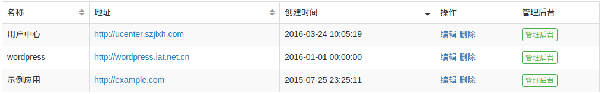
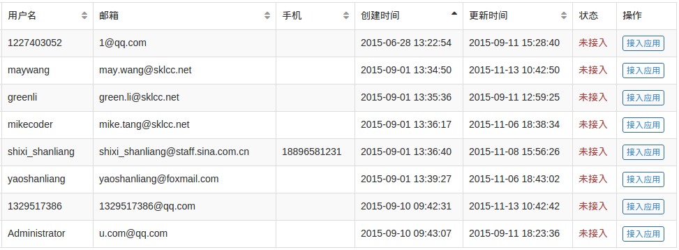
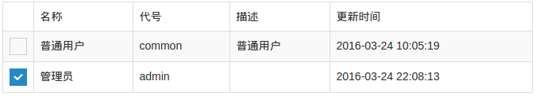
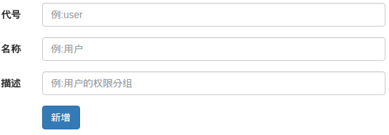
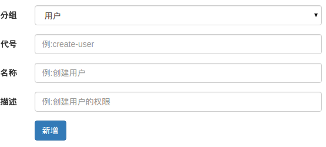
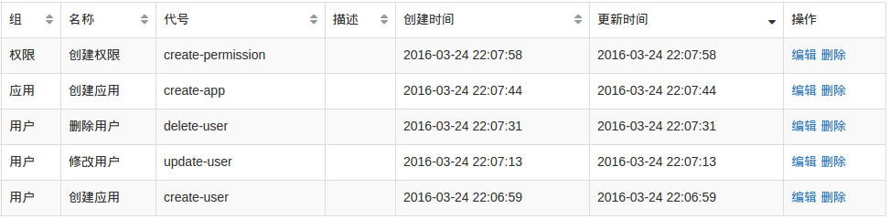
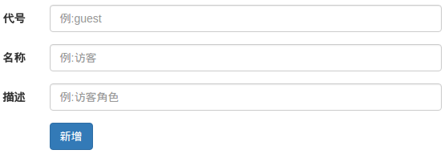
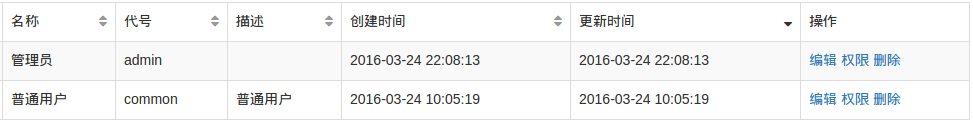
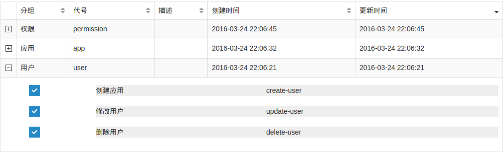
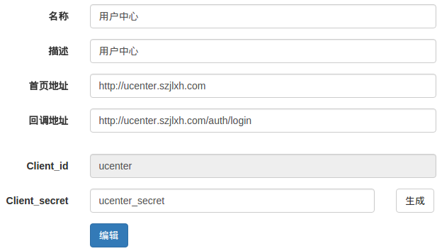

概述
=======

用户中心 UCenter，集“统一身份认证服务”、“用户系统”、“权限系统”、“日志系统”、“文件系统”、“邮件服务”、“短信服务”等于一体，
旨在为开发者提供统一的管理、调用服务，让开发更简单！

*注：本项目源码托管在Github: [用户中心](https://github.com/yaoshanliang/ucenter) -
[开放平台](https://github.com/yaoshanliang/ucenter-open), 关注本项目会收到相应通知，例如接口修改等。欢迎提交 PR。*

## 1. 接入指南

### 1.1 创建应用
* 在**应用 -> 创建应用**页面添加应用，注册要接入 UCenter 的应用。

* 其中**回调地址**是用户授权后，UCenter 回调到应用，并且回传**授权码**的地址。保存后，会返回到应用列表。

* 此时再查看应用，会生成 `client id` 和 `client secret`。保存 `client id` 和 `client secret`，以便后续认证使用。

### 1.2 调用API

* 开发者调用"用户"、"角色"、"权限"、"短信"、"邮件"、"日志"等API进行开发

[API 详细 >][api]

### 1.3 接入用户
* 在**用户 -> 用户总库**页面接入用户，并分配相应的角色。

### 1.4 接入权限、角色、日志等
* 在**权限 -> 权限分组 -> 新增分组**页面创建新的权限分组。

* 在**权限 -> 新增权限 **页面创建新的权限，并分配权限组。

* 在**角色 -> 新增角色 **页面创建新的角色。

* 在**角色**页面分配对应角色的权限。

### 1.5 测试上线

* 测试上线时注意更新`client secret`

## 2. Q&A

### 2.1 应用中的用户怎么来？

自行注册，申请某个应用的访问权限，待应用管理员允许后方可登陆访问；
应用管理员从**用户总库**中选择可以访问的用户，用户总库中不存在时可添加(导入)用户；

### 2.2 应用中的用户权限怎么管理？

应用管理员在用户中心的后台管理中选择可访问的用户，分配相应的角色，分配相应的权限。

### 2.3 一个用户可以多个角色吗？

可以。一个用户可以拥有多个应用，在一个应用中也可以拥有多个角色。
可以在应用中进行角色的切换，如：应用开发者也是应用管理员的角色。

[api]: api.html
